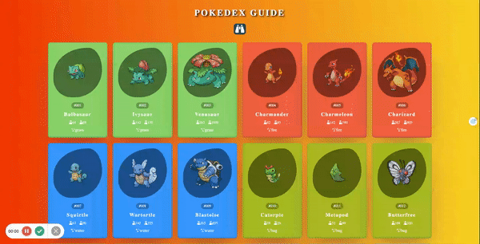

# Pokemon Cards Web Application

This simple web application is developed using HTML, CSS, and JavaScript. It fetches Pokemon cards from the PokeAPI and allows users to filter Pokemon cards by typing a name into the search bar.

## How It Works

1. Visit the web page.
2. Type a Pokemon name into the search bar.
3. Pokemon cards with the entered name will be displayed on the screen.

## Technologies Used

- HTML5
- CSS3
- JavaScript 

